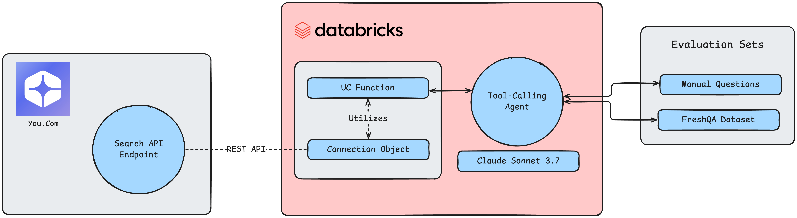

# Real Time Intelligence for Agents on Databricks with You.com

Retrieval Augmented Generation (RAG) systems operate by retrieving content related to an input query, incorporating the retrieved content into a prompt, then using an LLM generate a final response relative to the user's query and retrieved content. Having high-quality content retrieval is a critical piece toward improving the overall quality of any RAG system.

[You.com](https://you.com)’s developer-friendly APIs deliver real-time, low-latency web and news data, enabling developers to build applications that seamlessly integrate real-time public data from across the entire web at enterprise scale. Whether you’re enhancing large language models (LLMs) or building custom agents, anyone can have access to the entire web with just a few lines of code. 

In this solution accelerator, we show how Databricks and You.com makes it possible to:

* **Access real-time knowledge** from the web and news

* **Empower AI agents** with fresh context for better responses

* **Evaluate agent performances** using Databricks-native MLflow tools.

Reference Blog:
[Unlocking Real-Time Intelligence for AI Agents with You.com and Databricks Blog](https://you.com/articles/unlocking-real-time-intelligence-for-ai-agents-with-you.com-and-databricks)

# Architecture Diagram

# Notebooks

1. [`01-agent-configs`](./src/01-agent-configs.ipynb): This notebook establishes a You.com Connection via a Unity Catalog Function.
2. [`02-define-agent`](./src/02-define-agent.ipynb): This notebook defines the agentic logic that appends the UC function from 01 to a base LLM.
3. [`03-create-agent`](./src/03-create-agent.ipynb): This notebook creates the agent define in 02 via ML Flow tracing.
4. [`04-evaluate-agent`](./src/04-evaluate-agent.ipynb): This notebook creates an evaluation dataset using the agent created in 03.

## How to get help

Databricks support doesn't cover this content. For questions or bugs, please open a GitHub issue and the team will help on a best effort basis.

## License

&copy; 2025 Databricks, Inc. All rights reserved. The source in this notebook is provided subject to the Databricks License [https://databricks.com/db-license-source].  All included or referenced third party libraries are subject to the licenses set forth below.

| library                                | description             | license    | source                                              |
|----------------------------------------|-------------------------|------------|-----------------------------------------------------|
